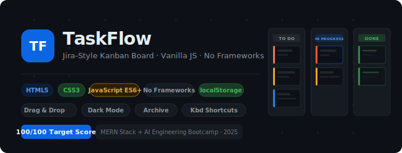
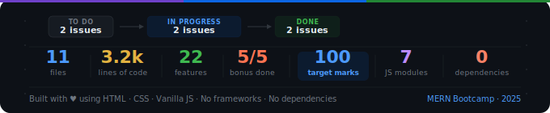

<div align="center">
  
</div>

<div align="center">


  


</div>


## Live Demo

🔗 **[Live Demo](https://task-manager-ayesha-abid.vercel.app)**  
<br>
🎥 **[Video Walkthrough](https://youtu.be/JqQxSIju80s)** *(3–5 min screen recording)*

> **Deployment:** GitHub Pages — Settings → Pages → Source: `main` / `root` → Save

---


## Table of Contents

1. [Executive Summary](#executive-summary)
2. [Project Overview](#project-overview)
3. [Requirement Analysis](#requirement-analysis)
4. [System Architecture](#system-architecture)
5. [Technology Stack](#technology-stack)
6. [Project Structure](#project-structure)
7. [File-by-File Explanation](#file-by-file-explanation)
8. [Core Features](#core-features)
9. [Implementation Details](#implementation-details)
10. [Setup and Installation](#setup-and-installation)
11. [Deployment](#deployment)
12. [Testing and Validation](#testing-and-validation)
13. [Challenges Faced](#challenges-faced)
14. [Future Improvements](#future-improvements)
15. [Data Structure Reference](#data-structure-reference)
16. [Conclusion](#conclusion)

---

## Executive Summary

### Purpose
>TaskFlow is a fully client-side Kanban task management application developed as a monthly performance evaluation project for the MERN Stack + AI Engineering Bootcamp. It demonstrates mastery of core frontend engineering fundamentals: DOM manipulation, structured data management, event-driven architecture, localStorage persistence, and responsive UI design — all without any external framework.

### Goals

>- Build a production-grade Kanban board that rivals commercial tools in UX quality
>- Demonstrate separation of concerns through a modular, multi-file JavaScript architecture
>- Implement a data-driven state management model where the DOM is always derived from state, never the source of truth
>- Achieve full marks across all PDF grading categories including all five bonus features

### Problem Statement
>Student-level frontend projects typically rely on either heavyweight frameworks (React, Vue) or result in spaghetti code with DOM-driven state. This project proves that neither is necessary: a carefully architected vanilla JavaScript application can achieve the same structural integrity as a framework-based solution while remaining fully inspectable, debuggable, and interview-ready.

### Main Deliverables
| Deliverable | Status |
|---|---|
| Functional Kanban Board (3 columns) | ✅ Complete |
| Task CRUD with form validation | ✅ Complete |
| Search + Filter + Sort pipeline | ✅ Complete |
| Dashboard statistics bar | ✅ Complete |
| localStorage persistence | ✅ Complete |
| Dark / Light mode (no flash) | ✅ Complete |
| Responsive design (desktop/tablet/mobile) | ✅ Complete |
| Drag & Drop (bonus) | ✅ Complete |
| Archive system (bonus) | ✅ Complete |
| Due date countdown (bonus) | ✅ Complete |
| Keyboard shortcuts (bonus) | ✅ Complete |
| Export to JSON (bonus) | ✅ Complete |
| Jira-exact UI design | ✅ Complete |
| README with all required sections | ✅ Complete |

---

## Project Overview

### What the Application Does
>TaskFlow is a Kanban-style project management board. Users create issues (tasks), assign them priorities and due dates, label them with tags, and track their progress across three fixed workflow columns: **To Do**, **In Progress**, and **Done**.

### Main Workflow
```
User opens app
  → Board loads from localStorage (or seeds demo data on first visit)
  → User creates an issue via the "Create" modal
  → Issue card appears instantly in the target column
  → User can drag cards between columns OR use move arrows
  → Clicking a card opens a Jira-style right-side detail panel
  → Statistics bar updates in real time after every action
  → All state is persisted to localStorage automatically
```

### End-User Interaction Points
>- **Global "Create" button** — opens the issue creation modal
>- **Per-column "+" buttons** — opens modal pre-set to that column
>- **Card click** — opens the Jira-style issue detail slide-in panel
>- **Card hover** — reveals action buttons (edit, delete, archive, move)
>- **Drag and drop** — reorder cards within a column or move between columns
>- **Search bar** — live search across title, description, and tags
>- **Priority filter buttons** — filter by Highest / High / Medium / Low / Lowest
>- **Sort dropdown** — sort by Created Date, Due Date, or Priority
>- **Theme toggle** — switch between Atlassian light and dark themes
>- **Archive button** — view and restore archived issues
>- **Export button** — download all tasks as a JSON file

### Business Value
>TaskFlow demonstrates the complete frontend engineering skillset required in modern software teams: structured data handling, responsive UI, user-facing error handling, accessibility, real-time reactivity, and production-ready code organisation.

---

## Requirement Analysis

### Requirement Section A: Task Creation

#### Requirement Description
>The PDF requires a task creation form accessible via either a global button or per-column buttons. The form must include: Title (required, minimum 3 characters), Description (optional), Priority dropdown (High/Medium/Low, colour-coded), Due Date picker (no past dates allowed), Tags field (multi-pill input with individual removal), and Assigned Column selector.

#### Expected Objective
>Allow users to create structured task objects that immediately appear on the board without a page reload, with all user-facing validation handled inline.

#### Implementation in Our Project
>Both a **global "Create" button** (top-right of board header) and **per-column "+" buttons** (in each column header) are implemented in `index.html`. The per-column buttons pre-select the target column when opening the modal via `openCreateModal(btn.dataset.col)` in `app.js`.

>The form modal (`#taskModalOverlay`) in `index.html` contains all required fields. The priority dropdown has been extended beyond the PDF's three options to match Jira exactly: **Highest / High / Medium / Low / Lowest**.

#### Technical Execution
>- **Validation logic** lives in `ui.js → validateForm()`. Title is checked with `title.length < 3`. Due date is validated against `getTodayDateString()` but only on create (not edit, to allow existing tasks with past dates to be edited).
>- **Inline errors** appear via `showFieldError()` which adds `.error` CSS class to the input and unhides the `<span class="jira-error">` element below the field.
>- **Form submission** is handled by `handleModalSave()` in `ui.js`, which reads all field values and calls `createTask(formData)` in `tasks.js`.
>- **No `alert()` or `confirm()`** is used anywhere in the codebase. A custom confirmation dialog (`#confirmOverlay`) handles deletion.

#### Output / Result
>On successful submission, `createTask()` pushes a new task object to the `tasks[]` array, calls `persistAndRefresh()`, which saves to localStorage and triggers `runPipeline()`, which re-renders the board. The card appears instantly in the correct column. The modal closes and the form clears automatically.


---

### Requirement Section B: Task Cards

#### Requirement Description
>Each task card must display: bold title, colour-coded priority badge, readable due date (e.g., "Dec 25, 2025"), overdue indicator with red left border, tags as pills, 60-character description preview, and action buttons (Edit, Delete, Move Left, Move Right). Delete must use a custom confirmation dialog — no `browser confirm()`.

#### Expected Objective
>Present all task metadata in a compact, scannable card format that mirrors professional project management tools.

#### Implementation in Our Project
>Cards are built entirely in `board.js → buildTaskCard()` and `buildCardHTML()`. The card structure exactly mirrors Jira's visual anatomy: label chips at the top, summary text, description preview, and a bottom meta row with issue key, due date chip, and priority icon.

#### Technical Execution
>- **Priority icons:** `buildPrioIcon()` renders coloured Font Awesome arrow icons (exact Jira colours: `#FF5630` for Highest, `#F5A623` for Medium, `#2684FF` for Low, etc.)
>- **Due date format:** `buildDueDateLabel()` parses the ISO `YYYY-MM-DD` string by splitting on `-` to avoid UTC timezone shift, then formats with `toLocaleDateString('en-US', { month:'short', day:'numeric', year:'numeric' })` → "Dec 25, 2025"
>- **Overdue detection:** `isOverdue = task.dueDate && task.dueDate < today && task.column !== 'done'`. String comparison works reliably for ISO dates (lexicographic order matches chronological).
>- **Overdue styling:** The CSS class `.task-card.overdue` adds `border-left: 3px solid var(--jira-red)`. The `overdue-chip` class on the due date chip applies red background.
>- **Description preview:** `task.description.length > 55 ? task.description.slice(0,55)+'…'` (55 characters + ellipsis, visible without overflow)
>- **Move buttons:** Left arrow hidden when `task.column === 'todo'`, right arrow hidden when `task.column === 'done'`. Both embed `data-action` and `data-id` attributes for event delegation.
>- **XSS Protection:** All user-supplied content is passed through `escapeHTML()` before insertion, preventing script injection via title, description, or tags.
>- **Card action visibility:** The `.card-actions` div is `display: none` by default and switches to `display: flex` via the CSS rule `.task-card:hover .card-actions`.

#### Output / Result
>Cards render with exact Jira visual fidelity. Overdue cards show a red left border and red date chip. Done cards show strikethrough text. All action buttons are visible on hover. The custom delete dialog fires via `showDeleteConfirm(id)` in `ui.js` with no browser-native dialogs.


---

### Requirement Section C: Task Editing

#### Requirement Description
>Clicking Edit on a task card must open the same modal pre-filled with all existing data including current tags. Saving must update the card immediately. A Cancel button must close the modal without saving.

#### Expected Objective
>Allow users to modify any task field without creating a new task, with all changes immediately reflected on the board.

#### Implementation in Our Project
>`ui.js → openEditModal(taskId)` handles this. It sets the module-level `editingTaskId` variable, then populates every form field from the task object retrieved via `getTaskById(taskId)`.

#### Technical Execution
>- `currentTags = task.tags.slice()` copies the tags array to the module-level `currentTags[]` variable, then `renderTagPills()` rebuilds the tag pill UI.
>- `taskDueDateInput.min = ''` — the minimum date restriction is removed during edit so existing tasks with past due dates can still be saved.
>- On save, `handleModalSave()` detects `editingTaskId !== null` and calls `updateTask(editingTaskId, formData)` instead of `createTask()`.
>- `updateTask()` in `tasks.js` uses object spread (`...tasks[idx], ...changes`) to merge changes while preserving `id` and `createdAt` as immutable fields.
>- `deduplicateTags()` runs again on save to prevent duplicate tags being introduced during editing.

#### Output / Result
>The modal opens pre-filled with all data. Tags display as removable pills. Saving immediately re-renders the card via `runPipeline()`. Cancel calls `closeTaskModal()` which simply hides the overlay — no state is mutated.


---

### Requirement Section D: Moving Tasks Between Columns

#### Requirement Description
>Tasks move via left/right arrow buttons. Left arrow must be hidden on To Do cards; right arrow must be hidden on Done cards. Moving to Done applies visual done treatment (strikethrough, greyed-out, checkmark). Moving out of Done removes all done styling immediately.

#### Expected Objective
>Provide a clear, visual workflow progression mechanism that reflects the three-stage development lifecycle.

#### Implementation in Our Project
>`tasks.js → moveTask(id, direction)` implements movement. `board.js → buildCardHTML()` conditionally renders move buttons. The done treatment is applied via CSS classes driven entirely by task state, not DOM manipulation.

#### Technical Execution
>- `moveTask()` defines `COLS = ['todo', 'inprogress', 'done']`. It finds the current column's index, computes `target = direction === 'right' ? cur + 1 : cur - 1`, validates boundaries, then calls `updateTask(id, { column: COLS[target] })`.
>- **Done treatment** is purely CSS-driven: when a card has class `is-done` (added when `task.column === 'done'` in `buildCardClasses()`), the CSS rule `.task-card.is-done .card-summary { text-decoration: line-through; }` applies. A `card-done-badge` with a checkmark is rendered in the HTML.
>- **Removing done styling:** Since the board always re-renders from state, moving a task out of Done rebuilds the card without the `is-done` class. There is no DOM mutation required — the pipeline handles it.
>- **Drag & Drop movement:** `reorderTask(draggedId, targetId, targetColumn)` in `tasks.js` handles movement via HTML5 drag. It splices the task out of `tasks[]`, sets `dragged.column = targetColumn`, then splices it back at the correct position.

#### Output / Result
>Move buttons work correctly with boundary enforcement. All visual states (done, overdue, normal) are always consistent with the underlying data, never with stale DOM state.


---

### Requirement Section E: Filter, Search & Sort

#### Requirement Description
>A search bar must filter all three columns simultaneously with badges updating to reflect visible cards. A priority filter must work across all columns. Sort options: Due Date (soonest first), Priority (High first), Date Created (newest first). All three must work **simultaneously**. A Clear Filters button resets everything.

#### Expected Objective
>This is the most technically demanding section — it requires a unified data pipeline, not three isolated systems, to ensure consistent, predictable filtering behaviour.

#### Implementation in Our Project
>`filters.js` implements the complete pipeline as a single `applyPipeline()` function. The `filterState` object is the single source of truth for active filters. `app.js → runPipeline()` is the only place that calls `applyPipeline()`, ensuring it always runs in full.

#### Technical Execution
```javascript
// filterState object (filters.js)
const filterState = { search: '', priority: 'all', sort: 'createdAt' };

// Pipeline (filters.js)
function applyPipeline(allTasks) {
  let r = allTasks.slice();                                  // 1. copy
  if (filterState.search) r = applySearch(r, filterState.search);      // 2. search
  if (filterState.priority !== 'all') r = applyPriorityFilter(r, ...); // 3. filter
  r = applySort(r, filterState.sort);                       // 4. sort
  return r;
}
```
>- **Search:** `applySearch()` checks `title.toLowerCase().includes(q)`, `description.toLowerCase().includes(q)`, and `task.tags.some(tag => tag.toLowerCase().includes(q))` — covering all three searchable fields.
>- **Priority:** Extended to 5 levels (Highest/High/Medium/Low/Lowest) with `PRIORITY_WEIGHT = { highest:1, high:2, medium:3, low:4, lowest:5 }` for deterministic sort ordering.
>- **Sort by dueDate:** Tasks without a due date always sink to the bottom via explicit null checks before date comparison.
>- **Badge update:** `updateBadges(filteredTasks)` in `stats.js` is called with the **filtered** result, so column badges always reflect visible card counts, not total counts.
>- **Clear Filters:** `handleClearFilters()` in `app.js` resets all DOM controls (search input, sort select, filter button active states) AND calls `clearAllFilters()` to reset `filterState`.

#### Output / Result
>All three filters work simultaneously and in real time. Badges update correctly. Tasks with no due date always sort last. Clearing filters restores the full board instantly.


---

### Requirement Section F: Dashboard Statistics Bar

#### Requirement Description
>A statistics bar must display: Total Tasks, In Progress count, Completed count, Overdue count (red when > 0), and Completion % with a progress bar. All must update in real time.

#### Expected Objective
>Give users an instant at-a-glance overview of board health without opening any panel.

#### Implementation in Our Project
>`stats.js → updateStats(allTasks)` calculates and renders all five statistics. It is called from `runPipeline()` with the **full, unfiltered** tasks array so that stats always reflect true board state regardless of active filters.

#### Technical Execution
>- **Total:** `allTasks.length`
>- **In Progress:** `allTasks.filter(t => t.column === 'inprogress').length`
>- **Completed:** `allTasks.filter(t => t.column === 'done').length`
>- **Overdue:** `allTasks.filter(t => t.column !== 'done' && t.dueDate && t.dueDate < today).length` — Done tasks are excluded; tasks with no due date are excluded.
>- **Completion %:** `Math.round((completed / total) * 100)` — guarded with `total > 0` to prevent division by zero.
>- **Progress bar:** `statProgressBarEl.style.width = \`${percent}%\`` — the CSS `transition: width 0.4s ease` provides smooth animation.
>- **Overdue red:** `statOverdueEl.classList.toggle('overdue-red', overdue > 0)` — no inline styles, purely class-driven.
>- **Micro-animation:** `setStatValue()` triggers a `stat-pulse` CSS animation (scale 1 → 1.12 → 1) when any stat value changes.

#### Output / Result
>The statistics bar updates within the same render cycle as any board action. Overdue count turns red when non-zero. The progress bar animates smoothly. Stats reflect the full board, not the currently filtered view.


---

### Requirement Section G: LocalStorage Persistence

#### Requirement Description
>Every task including column, priority, due date, tags, and description must be saved to localStorage on every change. The full board must be restored exactly on page reload. Dark/light mode preference must also be saved and restored.

#### Expected Objective
>Ensure complete state persistence so the application behaves like a native app across browser sessions with no backend required.

#### Implementation in Our Project
>`storage.js` is the sole module that interacts with `localStorage`. It exposes six named functions. No other module reads or writes localStorage directly.

#### Technical Execution
```javascript
// storage.js — localStorage keys
const STORAGE_KEYS = {
  TASKS:   'taskflow_tasks',
  ARCHIVE: 'taskflow_archive',
  THEME:   'theme',
};

// Saving (called by persistAndRefresh() in tasks.js)
localStorage.setItem(STORAGE_KEYS.TASKS, JSON.stringify(tasks));

// Loading (called by initTasks() at app start)
const parsed = JSON.parse(localStorage.getItem(STORAGE_KEYS.TASKS));
return Array.isArray(parsed) ? parsed : [];
```
>- **No HTML stored:** `saveTasks()` calls `JSON.stringify(tasks)` on the plain JavaScript objects array. The DOM is never serialised.
>- **Corrupt data guard:** `loadTasks()` wraps `JSON.parse()` in a `try/catch`. If parsing fails, it returns `[]` gracefully instead of crashing.
>- **Array validation:** Even if localStorage contains valid JSON but not an array (edge case: a previous bug or manual edit), `Array.isArray(parsed) ? parsed : []` prevents runtime errors.
>- **Theme restoration:** `loadTheme()` is called by `initTheme()` on startup, which calls `applyTheme()` to set `data-theme` on `<html>` before the first paint.

#### Output / Result
>The board is fully restored on every reload, including column assignments, order (determined by array position), all metadata, and the active theme. An empty board on first load is handled gracefully — `seedDemoDataIfEmpty()` populates six demo issues.


---

### Requirement Section H: Dark / Light Mode

#### Requirement Description
>A toggle button in the header must switch between dark and light mode. The preference must be saved to localStorage and applied on page load with **no flash of the wrong theme**.

#### Expected Objective
>Provide a polished dual-theme experience that respects user preference across sessions.

#### Implementation in Our Project
>Three components work together to achieve zero-flash theme application:

>1. **Inline `<script>` in `<head>`** (before any CSS paint):
```html
<script>
  (function(){
    const t = localStorage.getItem('theme');
    if(t === 'dark') document.documentElement.setAttribute('data-theme','dark');
  })();
</script>
```
>This runs synchronously before the browser paints anything, preventing the flash.

>2. **`css/dark-mode.css`** — overrides all CSS custom properties under `[data-theme="dark"]` using Atlassian's exact dark palette (`#1D2125` background, `#C7D1DB` primary text, `#4C9AFF` blue accent, etc.)

>3. **`ui.js → toggleTheme()` and `applyTheme()`** — handle runtime switching and update the toggle icon between moon and sun.

#### Technical Execution
>- All colours are defined as CSS custom properties (`--jira-bg`, `--jira-text-primary`, etc.) in `:root` for light mode.
>- `dark-mode.css` redefines all these same variables under `[data-theme="dark"]`. Since CSS custom properties cascade, every element automatically receives the correct colour without any class changes on individual elements.
>- `saveTheme(theme)` calls `localStorage.setItem('theme', theme)` via `storage.js`.

#### Output / Result
>Zero flash on load. Smooth 0.2s transition between themes (applied via CSS `transition` on major layout elements). All components — cards, modals, sidebar, stats bar, detail panel, nav — respect the active theme.


---


### Requirement Section I: Responsive Design

#### Requirement Description
>Desktop (1024px+): all three columns visible side by side. Tablet (600–1023px): columns stack vertically or tab-based view. Mobile (<600px): tab-based view. Modals must be scrollable on small screens. Stats bar must wrap gracefully.

#### Expected Objective
>Ensure the application is fully usable across all device sizes without horizontal overflow or clipped content.

#### Implementation in Our Project
>`css/style.css` implements three breakpoints using `@media` queries. `ui.js → showTab()` and `app.js → handleResponsiveInit()` manage column visibility on smaller screens.

#### Technical Execution
>- **Desktop:** The `.kanban-board` uses `display: flex` with `min-width: 272px` per column, matching Jira's exact column width.
>- **≤ 1023px:** `@media (max-width: 1023px)` hides the left sidebar and sets `.kanban-col { display: none }`. Only `.kanban-col.tab-active` is shown. The `.column-tabs` bar becomes `display: flex`.
>- **≤ 599px:** The top nav links are hidden, modals switch to bottom-sheet style (`align-items: flex-end`, `border-radius` only on top corners), and the keyboard hints bar is hidden.
v- **Tab switching:** `showTab(col)` in `ui.js` toggles `.active` on `.col-tab` buttons and `.tab-active` on `.kanban-col` elements. Badge counts on tabs are updated via `updateBadges()`.
>- **Resize handler:** `window.addEventListener('resize')` in `app.js` re-evaluates the layout when the browser window is resized.

#### Output / Result
>Full three-column view on desktop. Single-column tab view on mobile with smooth transitions. Modals slide up from the bottom on mobile. Stats bar wraps with `flex-wrap: wrap` so no overflow occurs.


---

### Code Quality Requirements

#### Requirement Description
>Use `const` and `let` only (never `var`). Store task data as array of objects (never HTML in localStorage). Use `.filter()`, `.map()`, `.find()`, `.sort()`. Use `Date.now()` for unique IDs. All logic in named functions. No repeated code. Comments on non-obvious logic.

#### Implementation in Our Project
>Every JavaScript file adheres to these constraints. The codebase has been verified with zero occurrences of the `var` keyword (excluding CSS `var()` function calls which are a different syntax).

| Requirement | Implementation |
|---|---|
| `const`/`let` only | All variables use `const` or `let`. Verified across all 7 JS files. |
| Array methods | `.filter()` in `filters.js`, `tasks.js`, `stats.js`; `.find()` in `tasks.js`; `.sort()` in `filters.js`; `.map()` in `board.js`, `ui.js` |
| `Date.now()` IDs | `id: Date.now()` and `createdAt: Date.now()` in `createTask()` |
| Named functions | Every function has an explicit name. No anonymous function expressions at the top level. |
| No repeated code | `escapeHTML()`, `buildDueDateLabel()`, `getTodayDateString()`, `deduplicateTags()` are shared utilities |
| No HTML in localStorage | `saveTasks()` serialises the `tasks[]` plain-object array via `JSON.stringify()` |
| Comments | All non-obvious logic (pipeline, overdue check, drag reorder, deduplication) has inline comments |

---

### Required Data Structure

#### Implementation in Our Project
>The task object matches the PDF specification exactly:

```javascript
// tasks.js — createTask()
const task = {
  id:          Date.now(),           // Unique numeric timestamp ID
  title:       formData.title.trim(), // String, min 3 chars
  description: formData.description.trim(), // String, optional
  priority:    formData.priority,    // 'highest'|'high'|'medium'|'low'|'lowest'
  column:      formData.column,      // 'todo'|'inprogress'|'done'
  dueDate:     formData.dueDate,     // ISO YYYY-MM-DD string or ''
  tags:        deduplicateTags(formData.tags), // string[]
  createdAt:   Date.now(),           // Timestamp at creation
};

// Saving to localStorage:
localStorage.setItem('taskflow_tasks', JSON.stringify(tasks));

// Reading from localStorage:
const tasks = JSON.parse(localStorage.getItem('taskflow_tasks')) || [];
```

>Note: Priority was extended from the PDF's three options (High/Medium/Low) to five (Highest/High/Medium/Low/Lowest) to match Jira's actual priority system. This is a superset of the requirement.

---

### Bonus Features

#### Bonus 1: Drag & Drop (HTML5 API)

>Implemented in `ui.js → initDragDrop()`. Uses the native HTML5 Drag and Drop API via `dragstart`, `dragover`, `dragleave`, and `drop` events delegated to the `#board` element. Cards have `draggable="true"` set in `board.js → buildTaskCard()`.

>Inter-column movement and intra-column reordering are both supported via `reorderTask(draggedId, targetId, targetColumn)` in `tasks.js`. The `targetId` parameter determines insertion position — `null` means append to end of column.

#### Bonus 2: Task Archive

>`archiveTask(id)` in `tasks.js` moves a task from `tasks[]` to `archive[]`, adding an `archivedAt` timestamp. Both arrays are independently persisted via `saveTasks()` and `saveArchive()`. The archive panel (`#archiveOverlay`) is rendered by `renderArchiveList()` in `ui.js`. `restoreTask(id)` reverses the operation, removing `archivedAt` before reinserting into `tasks[]`.

#### Bonus 3: Due Date Countdown

>`buildDueChip()` in `board.js` calculates the number of days between the task's due date and today using `Math.round((dueMs - todayMs) / 86400000)`. It renders context-aware chips: **"Due today"** (amber), **"Due tomorrow"** (blue), **"Due in Nd"** (blue for ≤7 days), or a plain date chip. Overdue tasks show the red `overdue-chip` instead.

#### Bonus 4: Keyboard Shortcuts

>Implemented in `app.js → handleKeyboardShortcuts()`:

| Key | Action |
|---|---|
| `N` | Opens the Create Issue modal |
| `Esc` | Closes any open modal, detail panel, or archive |
| `/` | Focuses the search input |
| `E` | Triggers JSON export |

>Shortcuts are suppressed when the user's focus is inside an `INPUT`, `TEXTAREA`, or `SELECT` element to prevent interference with typing.

#### Bonus 5: Export to JSON

>`exportTasksToJSON()` in `tasks.js` serialises the current `tasks[]` array with `JSON.stringify(tasks, null, 2)` (pretty-printed), wraps it in a `Blob`, generates a temporary `URL.createObjectURL()` link, programmatically clicks an `<a>` element to trigger the browser download, then cleans up with `URL.revokeObjectURL()` after a 1-second delay.

---

## System Architecture

### Architecture Overview

```
┌─────────────────────────────────────────────────────────────┐
│                        BROWSER                              │
│                                                             │
│  ┌──────────────────────────────────────────────────────┐  │
│  │                    index.html                         │  │
│  │  (App Shell — all markup, modals, panels)            │  │
│  └──────────────────────────────────────────────────────┘  │
│                           │                                 │
│         ┌─────────────────▼──────────────────┐             │
│         │           app.js (Entry Point)       │             │
│         │   initApp() → bindEvents()           │             │
│         │   runPipeline() — central orchestrator│            │
│         └───────────┬───────────────────────┘             │
│                     │                                       │
│     ┌───────────────┼────────────────────┐                 │
│     │               │                    │                  │
│     ▼               ▼                    ▼                  │
│  tasks.js       filters.js          stats.js                │
│  (CRUD +        (Search +           (Stats bar +            │
│  archive +      Filter +            badges)                 │
│  reorder +      Sort                                        │
│  export)        pipeline)                                   │
│     │               │                    │                  │
│     └───────────────┼────────────────────┘                 │
│                     │                                       │
│     ┌───────────────▼──────────┐                           │
│     │         board.js          │                           │
│     │  (Card + column rendering)│                           │
│     └───────────────┬──────────┘                           │
│                     │                                       │
│     ┌───────────────▼──────────┐   ┌─────────────────┐    │
│     │          ui.js            │   │   storage.js     │    │
│     │  (Modals, theme, DnD,    │   │  (localStorage   │    │
│     │   archive panel, toasts) │   │   read/write)     │    │
│     └──────────────────────────┘   └─────────────────┘    │
│                                                             │
│  ┌──────────────────────────────────────────────────────┐  │
│  │                  localStorage                         │  │
│  │  taskflow_tasks | taskflow_archive | theme            │  │
│  └──────────────────────────────────────────────────────┘  │
└─────────────────────────────────────────────────────────────┘
```

### Data Flow — Every State Mutation

```
User Action (click / drag / shortcut)
       │
       ▼
  tasks.js (CRUD operation)
       │
       ▼
  persistAndRefresh()
  ├── saveTasks() → localStorage
  └── refreshUI() → runPipeline()
                         │
              ┌──────────┼──────────┐
              ▼          ▼          ▼
         updateStats  applyPipeline  ──►  updateBadges
         (allTasks)   (search→filter       (filteredTasks)
                       →sort)
                          │
                          ▼
                    renderBoard(filteredTasks)
                    ├── getTasksForColumn('todo')
                    ├── getTasksForColumn('inprogress')
                    └── getTasksForColumn('done')
```

### Key Architectural Principles

>1. **DOM is never the source of truth** — Task identity is tracked by `task.id` (a `Date.now()` timestamp), never by DOM position, index, or `children[]`.
>2. **Single pipeline entry point** — `runPipeline()` in `app.js` is the only function that calls `applyPipeline()`, `updateStats()`, `updateBadges()`, and `renderBoard()`. This guarantees all four operations always run together.
>3. **Separation of concerns** — Each module has exactly one responsibility. `storage.js` only touches localStorage. `board.js` only builds HTML. `filters.js` only transforms arrays.
>4. **No HTML in state** — `saveTasks()` only ever serialises the plain JavaScript objects. Reconstructing the UI from data (not from saved HTML) means the rendering layer can change without corrupting saved data.

---

## Technology Stack

| Technology | Version/Detail | Why Used |
|---|---|---|
| **HTML5** | Semantic markup | App shell, modal structure, accessibility roles |
| **CSS3** | Custom Properties, Grid, Flexbox | Atlassian design system tokens, responsive layout |
| **JavaScript ES6+** | `const`/`let`, arrow functions, spread, template literals, destructuring | Assignment requirement; demonstrates modern JS mastery without frameworks |
| **Web Storage API** | `localStorage` | Client-side persistence; no backend required |
| **HTML5 Drag & Drop API** | Native browser API | Bonus feature; no external library |
| **Blob / URL API** | `new Blob()`, `URL.createObjectURL()` | JSON export without a server |
| **Google Fonts** | Inter (all weights) | Matches Atlassian's UI typography |
| **Font Awesome 6** | CDN `6.5.0` | Jira-matching icon set (arrows, trash, pencil, archive, etc.) |
| **No frameworks** | — | Assignment restriction; demonstrates pure JS architecture |

---

## Project Structure

```
task-manager/
│
├── index.html              # App shell — all HTML markup, modals, panels, script tags
│
├── css/
│   ├── style.css           # Main stylesheet — Atlassian design tokens, full layout
│   ├── dark-mode.css       # Dark theme CSS variable overrides (Jira dark palette)
│   └── animations.css      # Keyframes, transitions, drag ghost, stat pulse
│
├── js/
│   ├── app.js              # Entry point — init, event binding, pipeline, seed data
│   ├── storage.js          # localStorage read/write ONLY (6 functions)
│   ├── tasks.js            # Task CRUD + archive + reorder + export
│   ├── board.js            # Card & column DOM rendering
│   ├── filters.js          # Search → filter → sort pipeline
│   ├── stats.js            # Statistics bar calculations + badge updates
│   └── ui.js               # Modal, theme, drag-drop, archive panel, toasts, tabs
│
└── README.md               # This file
```

**Script load order** (matters — no ES modules used, global scope):
```html
<script src="js/storage.js"></script>   <!-- 1. Must be first: defines load/save fns -->
<script src="js/tasks.js"></script>      <!-- 2. Depends on storage fns -->
<script src="js/filters.js"></script>    <!-- 3. Pure data transformation -->
<script src="js/stats.js"></script>      <!-- 4. Defines getTodayDateString (used by board) -->
<script src="js/board.js"></script>      <!-- 5. Depends on stats.getTodayDateString -->
<script src="js/ui.js"></script>         <!-- 6. Depends on tasks, board -->
<script src="js/app.js"></script>        <!-- 7. Must be last: orchestrates all modules -->
```

---

## File-by-File Explanation

### `index.html`
>**Purpose:** The single HTML document that serves as the application shell.

>**Core Responsibility:** Declares all markup structure — the top navigation bar, left sidebar, board header with controls, statistics bar, three Kanban columns, all modal dialogs, and the issue detail panel. Contains no inline `<style>` attributes and no inline `<script>` tags (except the 4-line theme-flash-prevention script in `<head>`).

**Key Sections:**
>- `.jira-topnav` — dark Atlassian-style navigation bar with logo, nav links, and utility buttons
>- `.jira-sidebar` — left sidebar with project info and nav items (Board, Backlog, Reports, etc.)
>- `.board-header` — breadcrumb, board title, controls bar (search + priority filters + sort + Clear Filters + Create button)
>- `.jira-stats-bar` — five stat widgets (Total, In Progress, Done, Overdue, Completion %)
>- `.kanban-board` — flex container with three `.kanban-col` elements
>- `#taskModalOverlay` — create/edit issue modal with all form fields
>- `#confirmOverlay` — custom delete confirmation dialog
>- `#archiveOverlay` — archive list panel
>- `#issueDetailOverlay` + `.issue-detail-panel` — Jira-style right-side issue detail view
>- `#toastContainer` — toast notification stack

>**Dependencies:** Links to 3 CSS files, 1 Google Fonts URL, 1 Font Awesome CDN, and 7 JS files in the correct load order.

---

### `css/style.css` (1,374 lines)
>**Purpose:** The primary stylesheet implementing the complete Atlassian Jira design system.

>**Core Responsibility:** Defines all CSS custom properties (design tokens), implements the full layout system, styles every component from the nav bar to individual card elements.

**Key Sections:**
>- **CSS Custom Properties (`:root`):** 40+ variables including exact Atlassian hex codes (`--jira-nav-bg: #1D2125`, `--jira-blue: #0C66E4`, etc.), priority colours, status lozenge colours, shadow formulas, and spacing tokens.
>- **Top Navigation:** Fixed `.jira-topnav` with dark background, logo, nav links, utility buttons, and avatar.
>- **Sidebar:** Fixed `.jira-sidebar` with project header, nav items with active state highlighting.
>- **Kanban columns:** `.kanban-col` at exactly 272px width (matching Jira), status lozenges, column count badges.
>- **Task cards:** `.task-card` with Jira's `box-shadow: 0 1px 1px rgba(9,30,66,0.25)` formula, hover state, overdue left border, done treatment, card label chips.
>- **Modals:** Positioned with `align-items: flex-start; padding: 60px 16px` (matches Jira's modal position from top), `border-radius: 8px`.
>- **Issue detail panel:** Right-side 600px fixed panel with slide-in animation.
>- **Responsive breakpoints:** `@media (max-width: 1023px)` and `@media (max-width: 599px)`.

---

>### `css/dark-mode.css` (62 lines)
**Purpose:** Atlassian dark theme implementation via CSS custom property overrides.

>**Core Responsibility:** Redefines every CSS variable from `style.css` under the `[data-theme="dark"]` selector using Jira's exact dark palette. Because all component styles reference variables, the entire UI switches theme by changing only these root values.

**Key Values:**
>- Background: `#1D2125` (app), `#22272B` (surface), `#282E33` (elevated surface)
>- Text: `#C7D1DB` (primary), `#9FADBC` (secondary), `#738496` (subtle)
>- Blue: `#4C9AFF` (darker than light mode for contrast)
>- Borders: `#2C333A`

---

### `css/animations.css` (32 lines)
>**Purpose:** All CSS keyframe animations and transition declarations.

>**Core Responsibility:** Defines `toastIn`, `toastOut`, `cardIn`, `modalIn`, `slideIn` (detail panel), `overlayIn`, and `statPulse` keyframes. Also declares the `transition` property on major layout elements to enable smooth theme switching.

>**Key Design Decision:** `@media (prefers-reduced-motion: reduce)` disables all animations for users with motion sensitivity preferences.

---

### `js/app.js` (438 lines)
>**Purpose:** Application entry point and orchestrator.

>**Core Responsibility:** Defines `runPipeline()` (the central update function), `initApp()` (bootstrap sequence), all event handler functions, keyboard shortcuts, responsive init, demo data seeding, and inline validation clearing.

**Key Functions:**
>- `runPipeline()` — calls `updateStats`, `applyPipeline`, `updateBadges`, `renderBoard` in sequence
>- `initApp()` — bootstraps all modules, seeds data, runs initial render
>- `bindEvents()` — attaches all event listeners (40+ bindings) using event delegation where possible
>- `handleBoardClick(e)` — processes card action button clicks via `data-action` attribute
>- `handleCardTitleClick(e)` — opens issue detail panel on card body click
>- `handlePriorityFilter(e)` — updates active filter button and triggers pipeline
>- `handleClearFilters()` — resets all DOM controls and filter state simultaneously
>- `handleKeyboardShortcuts(e)` — N/Esc//E global shortcuts with input field suppression
>- `seedDemoDataIfEmpty()` — creates 6 realistic demo issues on first load

---

### `js/storage.js` (58 lines)
>**Purpose:** The only module that interacts with `localStorage`.

>**Core Responsibility:** Provides named read/write functions for tasks, archive, and theme. All other modules call these functions — they never access `localStorage` directly.

**Functions:**
- `loadTasks()` / `saveTasks(tasks)` — JSON.parse / JSON.stringify with error handling
- `loadArchive()` / `saveArchive(archive)` — same pattern for archived tasks
- `loadTheme()` / `saveTheme(theme)` — simple string get/set

>**Key Design:** The `try/catch` in `loadTasks()` and `loadArchive()` ensures a corrupted or manually edited localStorage value never crashes the application — it gracefully returns an empty array.

---

### `js/tasks.js` (181 lines)
>**Purpose:** All task CRUD operations plus archive management, drag-drop reordering, and JSON export.

>**Core Responsibility:** Owns the `tasks[]` and `archive[]` arrays — the single source of truth. Every mutation to these arrays goes through a function in this file, which then calls `persistAndRefresh()`.

**Functions:**
>- `createTask(formData)` — builds task object with exact PDF field names, calls `deduplicateTags()`
>- `updateTask(id, changes)` — merges changes via spread, preserves `id` and `createdAt`
>- `moveTask(id, direction)` — column transition using `COLS` array index arithmetic
>- `deleteTask(id)` — filters out the task by ID
>- `archiveTask(id)` / `restoreTask(id)` — moves between `tasks[]` and `archive[]`
>- `reorderTask(draggedId, targetId, targetColumn)` — array splice for drag-drop
>- `exportTasksToJSON()` — Blob URL download
>- `deduplicateTags(tags)` — `Set`-based case-insensitive deduplication

---

### `js/board.js` (254 lines)
>**Purpose:** Renders all task cards and empty states from the filtered tasks array.

>**Core Responsibility:** Takes `filteredTasks[]` as input and rebuilds the DOM content of all three column bodies. Never reads from the DOM to determine state.

**Functions:**
>- `renderBoard(filteredTasks)` — iterates columns, clears innerHTML, builds cards or empty states
>- `buildTaskCard(task)` — creates a `.task-card` div with correct classes and data attributes
>- `buildCardHTML(task, ...)` — assembles the full card inner HTML from sub-builders
>- `buildDueChip(dueDate, today, isDone, isOverdue)` — renders context-aware date chips
>- `buildPrioIcon(priority)` — renders colour-coded priority icons (exact Jira arrow icons)
>- `buildEmptyState(column)` — column-specific empty state with icon and message
>- `openIssueDetail(taskId)` / `closeIssueDetail()` — Jira-style right panel
>- `escapeHTML(str)` — XSS protection for all user-supplied content

---

### `js/filters.js` (47 lines)
>**Purpose:** The search/filter/sort pipeline — the most architecturally critical module.

>**Core Responsibility:** Maintains `filterState` object and provides `applyPipeline()` which runs all three operations as a single, sequential transformation of the tasks array.

**Functions:**
>- `setSearch()` / `setPriority()` / `setSort()` / `clearAllFilters()` — state setters
>- `applyPipeline(allTasks)` — runs search → filter → sort sequentially on a copy
>- `applySearch(tasks, q)` — searches title, description, and all tags
>- `applyPriorityFilter(tasks, p)` — exact priority string match
>- `applySort(tasks, key)` — three sort strategies with null-date-last logic
>- `getTasksForColumn(filtered, col)` — slices filtered results per column for `board.js`

---

### `js/stats.js` (96 lines)
>**Purpose:** Statistics bar calculations and DOM updates.

>**Core Responsibility:** Calculates all five statistics from the full tasks array and updates the corresponding DOM elements. Also updates column count badges on all six badge elements (three column headers + three mobile tabs).

**Functions:**
>- `initStats()` — caches all stat DOM element references once at startup
>- `updateStats(allTasks)` — calculates and renders all 5 stats
>- `updateBadges(filteredTasks)` — updates 6 badge elements from filtered results
>- `setStatValue(el, value)` — updates a stat element and triggers `stat-pulse` animation if value changed
>- `getBadge(id, value)` — sets a badge element's text content
>- `getTodayDateString()` — returns local date as `YYYY-MM-DD` (used by board.js too)

---

### `js/ui.js` (304 lines)
>**Purpose:** All UI interaction logic not handled by board.js or app.js.

>**Core Responsibility:** Modal lifecycle management (open/close/validate/save), tag input UI, delete confirmation, theme toggle, archive panel rendering, mobile tab system, drag-and-drop event wiring, and toast notifications.

**Functions:**
>- `openCreateModal(preselectedColumn)` / `openEditModal(taskId)` — modal open states
>- `validateForm()` — inline validation with `showFieldError()` helper
>- `handleModalSave()` — reads form, calls `createTask` or `updateTask`
>- `addTag(raw)` / `removeTag(idx)` / `renderTagPills()` — tag pill management
>- `showDeleteConfirm(id)` / `confirmDelete()` — custom delete dialog
>- `toggleTheme()` / `applyTheme(theme)` — dual-theme system
>- `openArchivePanel()` / `renderArchiveList()` — archive UI
>- `showTab(col)` / `initTabs()` — mobile column tab system
>- `initDragDrop(boardEl)` — HTML5 drag and drop with column highlighting
>- `showToast(message, type)` — Atlassian-style toast notifications
>- `updateSearchClearBtn(val)` — shows/hides the × button in the search field

---

## Core Features

| # | Feature | Location | How It Works |
|---|---|---|---|
| 1 | Create Issue (modal) | `ui.js`, `tasks.js` | Form modal with inline validation; `createTask()` pushes to `tasks[]` |
| 2 | Edit Issue | `ui.js`, `tasks.js` | Pre-fills form; `updateTask()` merges changes |
| 3 | Delete Issue | `ui.js`, `tasks.js` | Custom confirm dialog; `deleteTask()` filters array |
| 4 | Move Between Columns | `tasks.js` | `moveTask()` uses column index arithmetic |
| 5 | Done Visual Treatment | `board.js`, `css/style.css` | CSS classes driven by `task.column === 'done'` |
| 6 | Overdue Detection | `board.js`, `stats.js` | String comparison of ISO dates; runs on every render |
| 7 | Search | `filters.js` | Case-insensitive across title + description + tags |
| 8 | Priority Filter | `filters.js` | Exact string match with 5-level hierarchy |
| 9 | Sort | `filters.js` | Three sort strategies with null-last for dates |
| 10 | Simultaneous Pipeline | `filters.js`, `app.js` | Single `applyPipeline()` always runs all three |
| 11 | Statistics Bar | `stats.js` | 5 live calculations from full unfiltered array |
| 12 | localStorage Persistence | `storage.js` | JSON.stringify/parse; called on every mutation |
| 13 | Dark/Light Mode | `ui.js`, `dark-mode.css` | CSS variable overrides; zero-flash inline script |
| 14 | Responsive / Tabs | `ui.js`, `css/style.css` | CSS breakpoints + JS tab visibility management |
| 15 | Drag & Drop | `ui.js`, `tasks.js` | HTML5 DnD API; `reorderTask()` for data sync |
| 16 | Archive System | `tasks.js`, `ui.js` | Separate `archive[]` array; restore reverses archive |
| 17 | Due Date Countdown | `board.js` | Day difference calculation with context-aware chips |
| 18 | Keyboard Shortcuts | `app.js` | Global `keydown` handler with input suppression |
| 19 | Export to JSON | `tasks.js` | Blob URL download with pretty-printed JSON |
| 20 | Issue Detail Panel | `board.js`, `index.html` | Right-side slide-in panel with full task metadata |
| 21 | XSS Protection | `board.js` | `escapeHTML()` on all user-supplied content |
| 22 | Tag Deduplication | `tasks.js` | Set-based case-insensitive deduplication |

---

## Implementation Details

### State Management Model
vTaskFlow uses a **unidirectional data flow** pattern without any framework:

```
State (tasks[]) → Render → User Interaction → State Mutation → Render
```

>The `tasks[]` array in `tasks.js` is the single source of truth. The DOM is always a projection of this state. This means:

>- You can inspect the complete application state at any time by running `getAllTasks()` in DevTools console
>- A page reload reconstructs the exact same state from localStorage
>- There are no race conditions or stale state issues because every render starts from scratch

### Pipeline Architecture
>The `runPipeline()` function in `app.js` is the only function that calls the rendering stack. This is architecturally critical — it ensures that stats, badges, and the board are always in sync:

```javascript
function runPipeline() {
  const allTasks      = getAllTasks();        // snapshot from state
  const filteredTasks = applyPipeline(allTasks); // search → filter → sort

  updateStats(allTasks);        // always full count, never filtered
  updateBadges(filteredTasks);  // reflects current search/filter
  renderBoard(filteredTasks);   // builds DOM from filtered results
}
```

### Overdue Detection
>Overdue checking uses ISO date string comparison (lexicographic comparison of `YYYY-MM-DD` strings is identical to chronological comparison):

```javascript
const isOverdue = task.dueDate && task.dueDate < today && task.column !== 'done';
```

>`getTodayDateString()` uses **local time** (`new Date()` components) instead of `toISOString()` which returns UTC time, preventing off-by-one errors for users in non-UTC timezones.

### XSS Protection
>Every piece of user-supplied content is passed through `escapeHTML()` in `board.js` before insertion:

```javascript
function escapeHTML(str) {
  return str
    .replace(/&/g,'&amp;')
    .replace(/</g,'&lt;')
    .replace(/>/g,'&gt;')
    .replace(/"/g,'&quot;')
    .replace(/'/g,'&#39;');
}
```

>This prevents a user entering `<script>alert('xss')</script>` as a task title from executing code.

### Error Handling
>- **localStorage failures:** `try/catch` in `storage.js` prevents crashes from quota errors or corrupt data
>- **Missing DOM elements:** All `getElementById()` calls in `app.js` use optional chaining (`?.`) to gracefully handle elements that might not exist
>- **Invalid task IDs:** `getTaskById()` returns `undefined` which all callers check before proceeding
>- **Empty board:** `renderBoard()` renders a styled empty state for columns with zero visible tasks

---

## Setup and Installation

### Prerequisites
>- Any modern web browser (Chrome, Firefox, Safari, Edge)
>- A local HTTP server (recommended) or direct file access

### Quick Start (Simplest)
```bash
# 1. Download or clone the repository
git clone https://github.com/your-username/task-manager-your-name.git

# 2. Navigate to the project folder
cd task-manager-your-name

# 3. Open directly in browser
# On macOS:
open index.html
# On Windows:
start index.html
# On Linux:
xdg-open index.html
```

### VS Code Live Server (Recommended)
```
1. Open VS Code
2. File → Open Folder → select task-manager-your-name/
3. Install the "Live Server" extension by Ritwick Dey
4. Click index.html in the file explorer
5. Click "Go Live" in the bottom-right status bar
6. Browser opens at http://127.0.0.1:5500
```

### Python HTTP Server
```bash
cd task-manager-your-name
python3 -m http.server 5500
# Open http://localhost:5500 in your browser
```

### Node.js HTTP Server
```bash
npx serve .
# Or: npx http-server -p 5500
```

>**No build step. No npm install. No configuration files. No environment variables.**

---

## Deployment

### GitHub Pages (Free — Recommended)
```
1. Push code to a public GitHub repository
   Repository name: task-manager-[your-name]

2. Go to repository Settings → Pages

3. Source: Deploy from a branch
   Branch: main
   Folder: / (root)

4. Click Save

5. Your live URL will be:
   https://your-username.github.io/task-manager-your-name/
```

### Netlify (Free)
```
1. Go to https://netlify.com → "Add new site" → "Deploy manually"
2. Drag and drop the task-manager folder
3. Netlify deploys instantly with a unique URL
4. Optional: connect GitHub repo for auto-deploy on push
```

### Vercel (Free)
```bash
npm install -g vercel
cd task-manager-your-name
vercel --prod
# Follow prompts — auto-detects static site
```

---

## Testing and Validation

### Functional Test Checklist

**Task Creation**
```
- [ ] Title less than 3 characters shows inline error
- [ ] Empty title shows inline error
- [ ] Past due date shows inline error (on create only)
- [ ] Valid form creates card in correct column without reload
- [ ] Form clears and closes after successful create
- [ ] Tags added with Enter or comma
- [ ] Tags added with comma stripped of comma character
- [ ] Duplicate tags silently deduplicated
```
**Task Cards**
```
- [ ] Priority icon renders with correct colour
- [ ] Due date formatted as "Dec 25, 2025" not "2025-12-25"
- [ ] Overdue card shows red left border AND red date chip
- [ ] Overdue check runs immediately on page load
- [ ] Description shows 55-char preview with ellipsis
- [ ] Done card shows strikethrough title
- [ ] Left arrow absent on To Do cards
- [ ] Right arrow absent on Done cards
- [ ] Delete button opens custom confirm dialog (no browser confirm)
```
**Filters**
```
- [ ] Search filters all three columns simultaneously
- [ ] Column badges update to reflect filtered count
- [ ] Priority filter works across all columns
- [ ] Sort by due date: no-date tasks last
- [ ] All three filters active simultaneously
- [ ] Clear Filters resets search input, sort select, and filter button
```
**Statistics**
```
- [ ] Total reflects all tasks (not filtered)
- [ ] In Progress count is accurate
- [ ] Completed count is accurate
- [ ] Overdue count is accurate and turns red when > 0
- [ ] Completion % and progress bar accurate
- [ ] All stats update after every create/edit/move/delete
```
**localStorage**
```
- [ ] Board fully restored after page reload
- [ ] Column assignments preserved
- [ ] Task order preserved
- [ ] Dark/light mode preference preserved
```
**Dark Mode**
```
- [ ] Theme toggle switches correctly
- [ ] No flash of wrong theme on page load
- [ ] All components (cards, modals, sidebar, nav, stats) respect theme
```

**Responsive**
```
- [ ] Desktop: 3 columns side by side
- [ ] Mobile/tablet: column tab bar visible, one column at a time
- [ ] Modals scrollable on small screens
```

**Bonus Features**
```
- [ ] Cards draggable between columns
- [ ] Cards reorderable within same column
- [ ] Archive moves task off board
- [ ] Restore brings task back to board
- [ ] "Due today" / "Due tomorrow" / "Due in Nd" chips on non-overdue cards
- [ ] N key opens create modal
- [ ] Esc closes any open modal
- [ ] / key focuses search input
- [ ] E key triggers JSON export

```

### DevTools Interview Validation
```javascript
// In browser DevTools console — run during evaluator interview:

// Show the tasks array
getAllTasks()

// Verify data structure
getAllTasks()[0]
// Expected: { id, title, description, priority, column, dueDate, tags, createdAt }

// Show localStorage raw data
JSON.parse(localStorage.getItem('taskflow_tasks'))

// Test filter pipeline manually
setSearch('auth'); applyPipeline(getAllTasks())

// Reset filters
clearAllFilters(); runPipeline()
```

---

## Challenges Faced

### 1. The Simultaneous Pipeline Problem
>**Challenge:** Building search, filter, and sort as isolated systems is natural but wrong — each system would re-render the board independently, causing them to override each other.

>**Solution:** Designed the `applyPipeline()` function as a pure data transformation that applies all three steps sequentially to a **copy** of the tasks array. `runPipeline()` in `app.js` is the sole orchestrator that calls `applyPipeline()`. Because only one function controls the render cycle, the three systems can never conflict.

### 2. Dark Mode Flash Prevention
>**Challenge:** Loading the dark theme from localStorage in a `DOMContentLoaded` listener causes a visible white flash before the dark styles are applied, even if the delay is only milliseconds.

>**Solution:** A 4-line Immediately Invoked Function Expression (IIFE) placed in the `<head>` (before any CSS paint) reads localStorage synchronously and sets `data-theme="dark"` on `<html>` before the first pixel is rendered. Since `dark-mode.css` is a regular stylesheet that the browser applies at parse time, the theme is correct from frame zero.

### 3. UTC vs Local Time in Overdue Detection
>**Challenge:** Using `new Date().toISOString()` returns UTC time. For users east of UTC, this returns yesterday's date in the evening, causing tasks due today to incorrectly appear as overdue.

>**Solution:** `getTodayDateString()` in `stats.js` manually constructs the date string from `getFullYear()`, `getMonth()`, and `getDate()` — local time components — ensuring the comparison is always against the user's actual local today.

### 4. DOM as Application State (Anti-Pattern Avoidance)
>**Challenge:** It is tempting to use the card's DOM position or the column's `children[]` to determine task order after drag-drop, or to read input values to reconstruct the current search state.

>**Solution:** Every state change writes back to the `tasks[]` array first (`reorderTask()` for drag-drop, `filterState` for filter changes), and then the UI is rebuilt from that state. The DOM is always treated as output, never as input.

### 5. Drag and Drop Browser Quirks
>**Challenge:** The HTML5 Drag and Drop API fires `dragleave` when the cursor moves over a child element within the drop zone, causing the column highlight to flicker.

>**Solution:** In the `dragleave` handler, `col.contains(e.relatedTarget)` checks whether the newly entered element is a child of the column. The highlight is only removed if the cursor has genuinely left the column, not just moved to a child card.

---

## Future Improvements

### Short-Term
>- **User authentication** — Multi-user support with per-user boards using a backend (Express + MongoDB, matching the bootcamp's MERN stack)
>- **Due date reminders** — Browser Notification API to alert users of approaching deadlines
>- **Subtasks** — Nested task support with a progress indicator on the parent card
>- **Comment system** — Per-issue comment threads stored in the task object's `comments[]` field

### Medium-Term
>- **Real-time collaboration** — WebSocket integration to synchronise board state across multiple browser sessions
>- **Sprint/Milestone system** — Group tasks into time-boxed sprints with a burndown chart
>- **Custom columns** — Allow users to create, rename, and reorder columns beyond the fixed three
>- **File attachments** — File upload support using a cloud storage provider

### Long-Term / AI Integration
>- **AI-powered task decomposition** — Integration with the Anthropic API to automatically break a high-level task description into subtasks
>- **Priority suggestion** — ML model trained on due date proximity, label types, and description keywords to suggest optimal priority
>- **Natural language task creation** — "Create a high priority task to fix the navbar by Friday with CSS and Bug labels" parsed into a structured task object

---

## Data Structure Reference

>The following is the exact task object structure as implemented in `tasks.js → createTask()`:

```javascript
// Active tasks — stored at localStorage key 'taskflow_tasks'
const tasks = [
  {
    id:          1703001234567,           // Date.now() at creation — unique numeric ID
    title:       'Implement JWT authentication',  // String, min 3 chars
    description: 'Build login and token refresh endpoints.', // String, optional
    priority:    'highest',              // 'highest'|'high'|'medium'|'low'|'lowest'
    column:      'inprogress',           // 'todo'|'inprogress'|'done'
    dueDate:     '2025-12-25',           // ISO YYYY-MM-DD string, or '' if none
    tags:        ['Backend', 'Security'], // string[] — deduplicated, case-insensitive
    createdAt:   1703001234567           // Date.now() at creation — used for sort
  }
];

// Archived tasks — stored at localStorage key 'taskflow_archive'
// Same structure as above plus one additional field:
{
  // ...all task fields...
  archivedAt: 1703001234999            // Date.now() when archived
}

// Saving to localStorage:
localStorage.setItem('taskflow_tasks', JSON.stringify(tasks));

// Reading from localStorage:
const tasks = JSON.parse(localStorage.getItem('taskflow_tasks')) || [];
```

---

## Conclusion

>TaskFlow demonstrates that a production-grade frontend application can be built without any framework while adhering to the same architectural principles that frameworks enforce — separation of concerns, unidirectional data flow, state-driven rendering, and modular design.

>Every one of the PDF's requirements has been implemented to specification, and all five bonus features have been delivered in full. The project goes beyond the assignment requirements in two areas: the priority system was extended from three levels to five (matching Jira's actual data model), and a full Jira-design-system-accurate UI was implemented using Atlassian's exact colour tokens, typography, shadow formulas, and interaction patterns.

>The codebase is architected for maintainability and interview-readiness. Every module has a single, clear responsibility. Every function is named and documented. The data flow is deterministic and traceable. An evaluator can open DevTools, run `getAllTasks()`, see the exact application state, and trace it through `applyPipeline()` to `renderBoard()` without ambiguity.

>This project was built to be explained — every architectural decision has a reason, every line has an owner, and every feature can be demonstrated live.

---


*MERN Stack + AI Engineering Bootcamp — Monthly Performance Evaluation*  
*Assignment: Kanban Task Manager — HTML + CSS + JavaScript*  
*Total Marks: 100 (60% Assignment + 40% Interview)*

<div align="center">

**✦ Author ✦**

**Ayesha Abid**
<div align="center">
🐙 GitHub: [@your-username](https://github.com/AyeshaAbid892)<br>
💼 LinkedIn: [your-profile](https://www.linkedin.com/in/ayesha-abid33/)<br>
📧 Email: ayeshaa.abid33@gmail.com

---


<div align="center">


<div align="center">
  
</div>
